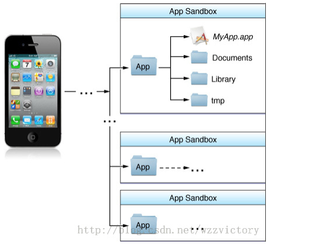

# iOS数据持久化
## 1.简介
        所谓持久化，就是将数据保存到硬盘中，使得在应用程序重启后可以继续访问之前保
    存的数据。
## 2.沙盒
        ios为每个应用程序创建了一个文件系统，应用程序稚嫩跟在该文件系统中读取文件，
    不可以去其他地方访问，此区域被称为沙盒。所有的非代码文件都要保存再次，例如图像
    、图标、声音、影像、属性列表、文本文件等；
        ps：
        ① 每个应用程序都有自己的存储空间；
        ② 应用程序不能翻过自己的围墙去访问别的存储空间的内容；
        ③ 应用程序请求的数据都要通过权限检测，加入不符合条件的话，不会被放行；
## 3.沙盒目录结构
        每个沙盒都有相似的目录结构，如图所示：

        具体包含四个目录：
        ① MyApp.app
            A.该目录包含了应用程序本身的数据，包含资源文件和可执行文件等。程序启动
        后，会根据需要从该目录中动态加载代码或资源文件到内存；
            B.整个目录是只读的：为了防止被篡改，应用在安装的时候回将该目录签名，非
        越狱情况下，该目录的内容是无法更改的，在越狱设备上，如果更改了目录内容，对
        应的签名就会被改变，这种情况下苹果官网描述的后果是应用程序将无法启动；
            C.该目录不会同步到iTunes；
        ② Document
            A.我们可以将应用程序的数据文件保存在该目录下。不过这些数据仅限于不可再
        生的数据，可再生的数据文件应该放在Library/Cache下。
            B.会被同步到iTunes；
        ③ Documents/Inbox
            A.该目录用来保存由外部应用请求当前应用程序打开的文件；比如我们的应用A，
        向系统注册了几种可打开的文件格式，B应用有一个支持A的格式的文件F，并申请调用
        A打开F，由于F在B的沙盒中，而沙盒机制不允许A访问B沙盒中的文件，因此苹果的解
        决方案是，将F拷贝一份到A应用的Documents/Inbox目录下，在让A打开F；
            B.会被同步到iTumes；
        ④ Libray
            A.苹果建议用来存放默认设置或其他的状态信息
            B.处理其中的Caches子目录外，会被同步到iTunes；
        ⑤ Library/Caches
            A.主要用来缓存文件，用户使用过程中缓存都可以保存到这个目录中，这个目录
        用来保存哪些可再生的文件，比如网络请求的数据，鉴于此，应用程序通常还需要
        负责删除这些文件；
            B.不会被同步到iTunes中；
        ⑥ Library/Preference
            A.用来存放应用程序的偏好设置文件，我们使用NSUserDefault写的数据设置数据
        都会保存到该目录下的一个plist文件中，
            B.是会被同步到iTunes中；
        ⑦ tmp
            A.保存各种临时文件，保存应用再次启动时不需要的文件，而且，当应用不在需要
        这些文件时应该主动将其删除，因为该目录下的东西随时可能被系统清理掉，目前已知
        的一种可能清理的原因是系统磁盘存储空间不足的时候；
            B.不会被同步到iTunes中。
## 4.获取目录路径的方式
        ① 沙盒目录：
            NSHomeDirectory();
        ② tmp
            NSTemporaryDirectory();
        ③ Myapp.app
            [[NSBundle mainBundle] bundlePath]
        ④ Documents
            NSSearchPathForDirectoriesInDomains(NSDocumentDirectory, 
                                                NSUserDomainMask, 
                                                YES)[0];
            ps:这里的NSSearchPathForDirectoriesInDomains三个参数的介绍
            A.第一个参数：NSSearchPathDirectory的枚举值，表示我们要搜索的目录名称，
        比如这里用NSDocumentDirectory表示我们搜索的是Documents目录，如果是NSCachesDirectory
        表示我们要搜索的是Library/Caches目录；
            B.第二个参数：NSSearchPathDomainMask的枚举值，指定搜索范围，这里
        NSUserDomainMask表示搜索的范围限制于当前应用的沙盒路径，还有NSLocalDomainMask
        (表示/Library)、NSNetworkDomainMask(表示/Network)等；
            C.第三个参数：BOOL值，表示是否展开波浪线~.YES表示返回的路径是全形式，
        NO表示把/User/userName用~表示。
## 5.数据持久化的几种方式
        ① plist文件（属性列表）
        ② preference（偏好设置）
        ③ NSKeyedArchiver（归档）
        ④ SQLite3
        ⑤ CoreData
